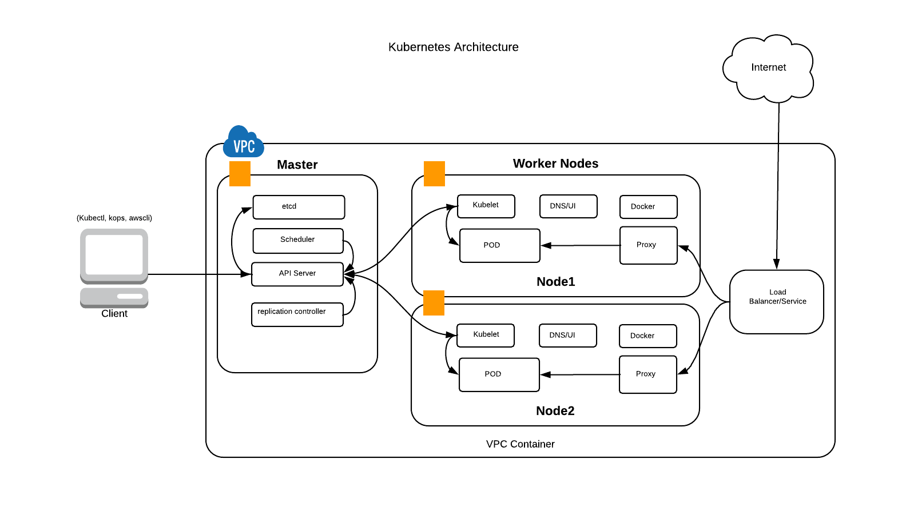

## Chapter 1: Kubernetes Concepts and Architecture
Kubernetes (k8s) is an open-source system for automating deployment, scaling, and management of containerized applications

Kubernetes has four main components:

* Client 
* Master
* Worker Nodes
* Service

### Client: 
Client is a local developer machine or any machine from where you execute commands to deploy resources in kubernetes. 
Client generally have below components:

#### kubectl: 
Kubectl is a command line interface for running commands against Kubernetes clusters
#### kops: 
Kubernetes Operations, or Kops, is an open source project used to set up Kubernetes clusters easily and swiftly
#### awscli or terraform: 
The AWS Command Line Interface (CLI) is a unified tool to manage your AWS services. 

### Master: 
Master components provide the cluster’s control plane. Master components make global decisions about the cluster. Component in master include:

#### Replication Controller: 
Manages the lifecycle of pods and ensures specified number are running
### etcd: 
Distributed key-value store used to persist Kubernetes system state
#### Scheduler: 
It watches newly created pods that have no node assigned, and selects a node for them to run on.
#### API Server: 
Component on the master that exposes the Kubernetes API.

### Worker Nodes: 
A node may be a VM or physical machine, depending on the cluster. Each node contains the services necessary to run pods and is managed by the master components.
Services on node include:

#### Pods: 
Main deployable unit.
#### Kubelet: 
It runs on each node in the cluster and is responsible for node level pod management.
#### DNS: 
Cluster DNS is a DNS server, in addition to the other DNS server(s) in your environment, which serves DNS records for Kubernetes services. Containers started by Kubernetes automatically include this DNS server in their DNS searches
#### Web UI: 
Dashboard is a general purpose, web-based UI for Kubernetes clusters
#### Kube-Proxy: 
kube-proxy enables the Kubernetes service abstraction by maintaining network rules on the host and performing connection forwarding

### Service: 
Single, stable name for a set of pods, also acts as load balancer
